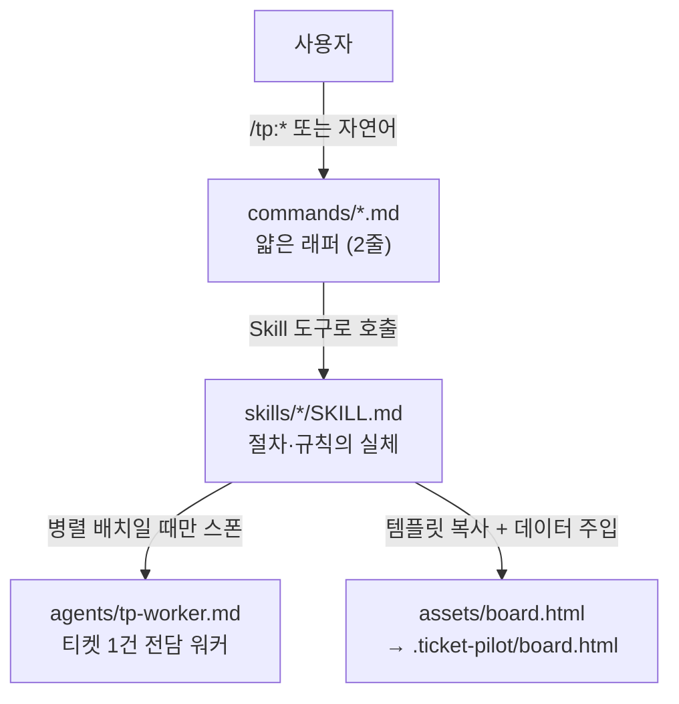
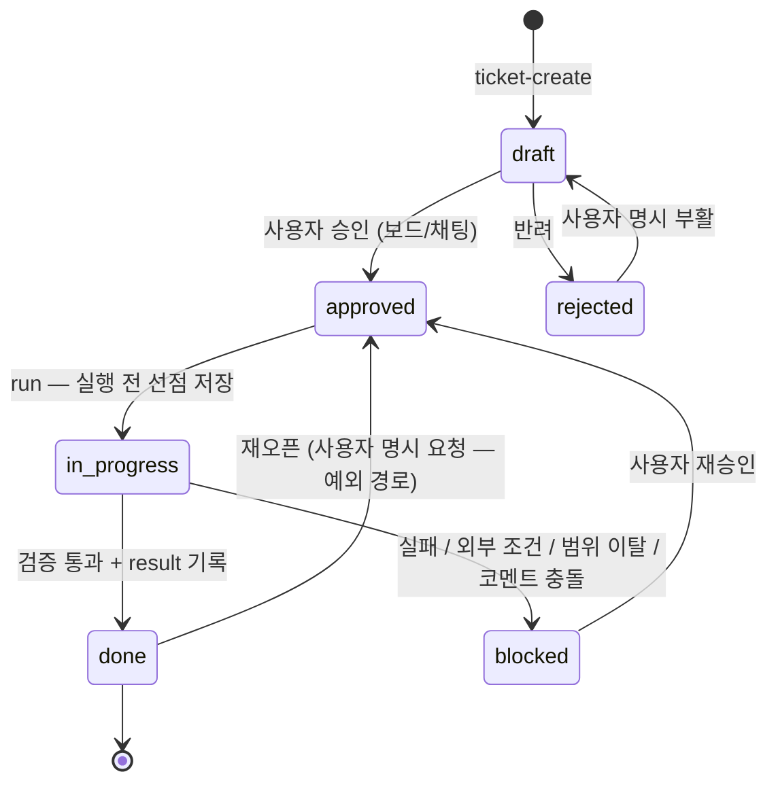
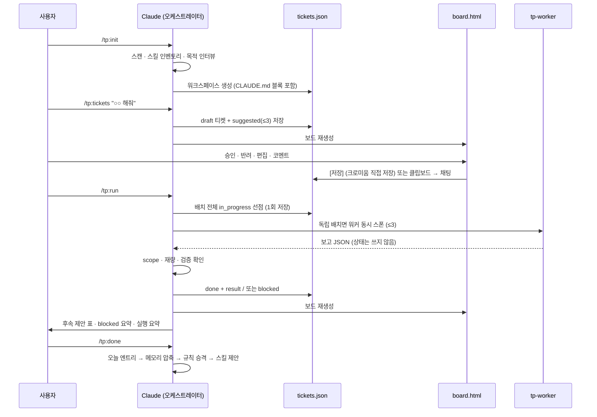
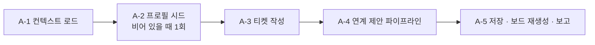
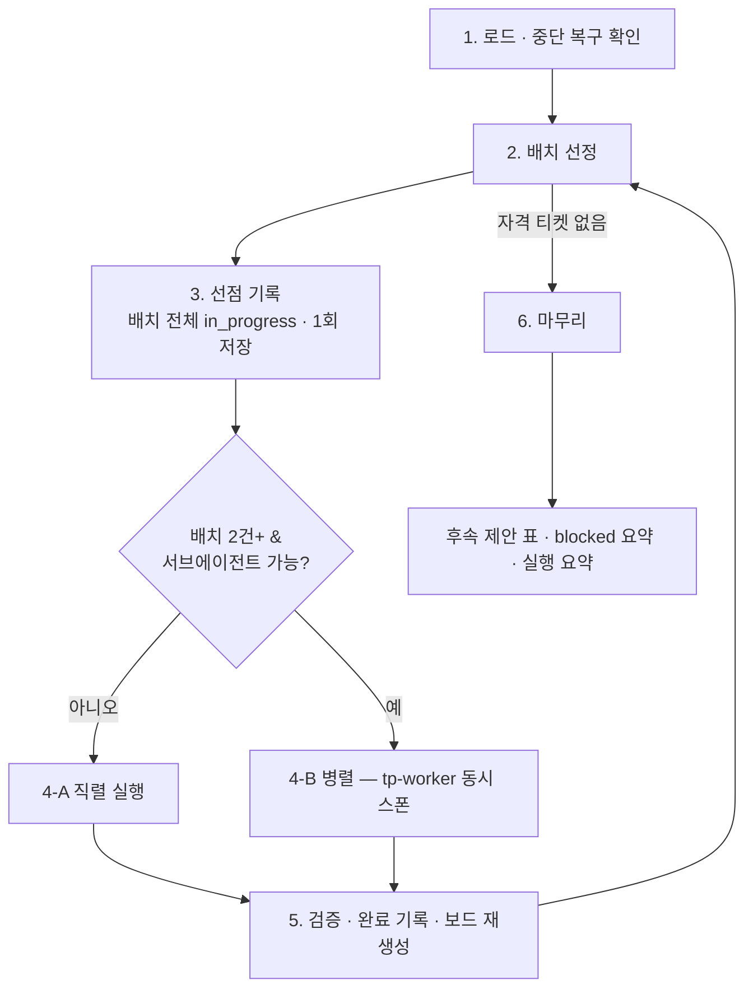
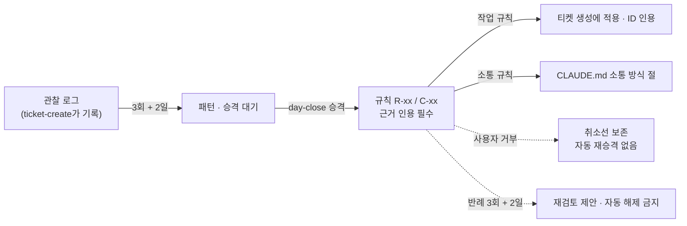
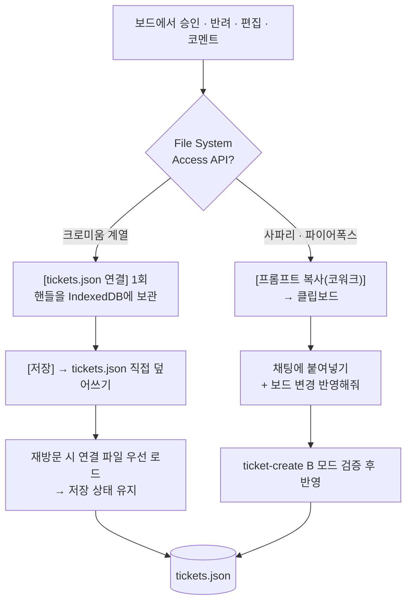
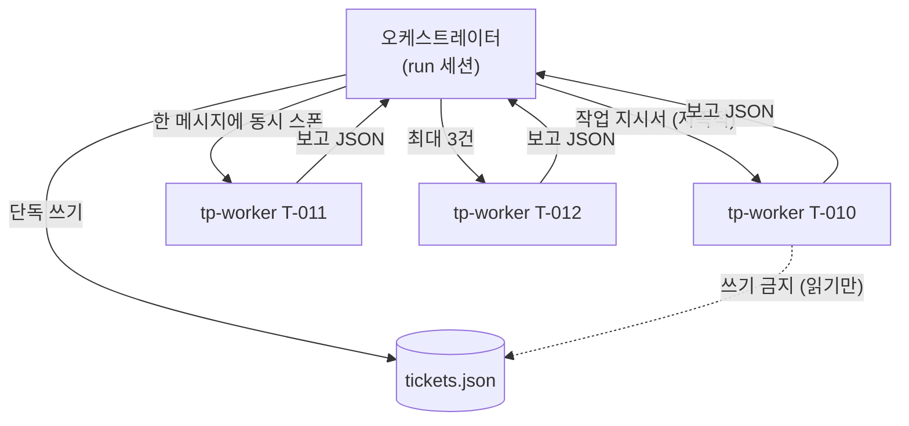

# Ticket Pilot — 구조와 프로세스

> 대상: 이 저장소(HT-Work)에 들어 있는 Claude Code / Cowork 플러그인 **`tp` (Ticket Pilot)**
> 기준 버전: **v0.7.0** (`ticket-pilot/.claude-plugin/plugin.json`)
> 작성 시점: 2026-07-30 · 이 문서는 현재 코드베이스를 읽어 정리한 **현황 문서**다.

---

## 1. 한 줄 요약

Ticket Pilot은 로컬 프로젝트의 LLM 작업을 **티켓 단위로 계획 → 승인 → 실행 → 보고**하고, **일 단위 메모리 3계층**으로 세션 간 맥락을 잇는 플러그인이다.

설계 의도는 두 가지다.

| 가치 | 구현 방식 |
|------|-----------|
| **통제** | 사용자가 승인(`approved`)한 티켓만 실행된다. 실행 시작 **전에** `in_progress`를 파일에 저장해, 세션이 끊겨도 같은 티켓이 두 번 실행되지 않는다. |
| **연속성** | `/tp:done` 한 번으로 하루가 `RECENT_MEMORY.md`에 기록되고, 오래된 기록은 주 → 월 단위로 자동 압축되어 다음 세션의 맥락이 된다. |

---

## 2. 저장소 전체 구조

이 저장소는 성격이 다른 세 덩어리로 나뉜다. **배포되는 것은 `ticket-pilot/` 하나뿐이다.**

```
HT-Work/
├── .claude-plugin/
│   └── marketplace.json          # 루트 마켓플레이스 — GitHub 설치 경로 (tp@ht-work)
│
├── ticket-pilot/                 # ★ 배포물 (플러그인 본체)
├── demo-project/                 # E2E 검증용 데모 웹앱 + 실제 실행된 .ticket-pilot/ 결과물
├── ticket-pilot-build-kit-v0.6/  # 이 플러그인을 만들 때 쓴 구축 실행 세트 (설계 기록)
└── README.md
```

| 덩어리 | 역할 | 런타임에 읽히는가 |
|--------|------|-------------------|
| `ticket-pilot/` | 플러그인 배포물 — 커맨드·스킬·에이전트·보드 템플릿 | **예** |
| `demo-project/` | 데모 프로젝트. 플러그인을 실제로 돌려 만든 `tickets.json`·메모리·프로필·증빙이 남아 있어 산출물 예시로 쓰인다 | 아니오 |
| `ticket-pilot-build-kit-v0.6/` | Phase 0~5 구축 절차·데이터 계약 원문·진행표(`_PROGRESS.md`)·E2E 시나리오 | 아니오 |

> **자족성 규칙**: 배포물(SKILL.md 등)은 구축 킷 없이 단독으로 완결되어야 한다. 배포물 안에 "구축계획서", "10-contracts", "§4.7 참조" 같은 문구가 남아 있으면 결함으로 본다 (`ticket-pilot-build-kit-v0.6/ticket-pilot-build/00-orchestrator.md`).

---

## 3. 플러그인 구조 (`ticket-pilot/`)

```
ticket-pilot/
├── .claude-plugin/
│   ├── plugin.json                     # name: tp · version: 0.7.0
│   └── marketplace.json                # 로컬 마켓플레이스 등록용 (tp@ticket-pilot)
├── commands/                           # 얇은 래퍼 5개 — 각 2줄, 스킬로 위임만 한다
│   ├── init.md      → project-setup
│   ├── tickets.md   → ticket-create
│   ├── run.md       → ticket-run
│   ├── done.md      → day-close
│   └── handoff.md   → session-handoff
├── skills/                             # 절차·규칙의 실체 (스킬 4종 + 보드 템플릿)
│   ├── project-setup/SKILL.md
│   ├── ticket-create/
│   │   ├── SKILL.md
│   │   └── assets/board.html           # 보드 템플릿 (단일 원본 — 임의 재작성 금지)
│   ├── ticket-run/SKILL.md
│   ├── day-close/SKILL.md
│   └── session-handoff/SKILL.md
├── agents/
│   └── tp-worker.md                    # 병렬 실행 워커 서브에이전트
└── README.md
```

### 3.1 3계층 구성



- **커맨드**는 로직을 갖지 않는다. `Skill` 도구로 해당 스킬을 호출하고, 도구를 쓸 수 없으면 `${CLAUDE_PLUGIN_ROOT}/skills/<name>/SKILL.md`를 직접 읽어 실행하라고 지시하는 폴백 한 줄이 전부다.
- **스킬**이 모든 절차·검증·데이터 계약을 담는다. 각 SKILL.md는 `목적 → 입력 → 실행 단계 → 완료 기준` 순서로 쓰여, 추가 맥락 없이 단독 세션에서 실행 가능하다.
- 스킬은 커맨드와 **1:1**이다. 과거 6종이던 스킬은 v0.5.1에서 4종으로 정리됐다 — 구 `ticket-optimize`는 `ticket-run`의 마무리 절차로, 구 `memory-optimize`는 `day-close`의 압축 절로 흡수됐다.

### 3.2 커맨드 · 스킬 · 자연어 트리거 매핑

| 커맨드 | 스킬 | 하는 일 | 자연어 트리거 예 |
|--------|------|---------|------------------|
| `/tp:init` | `project-setup` | 프로젝트 스캔 · 스킬 인벤토리 · 목적 인터뷰 → CLAUDE.md 블록 + `.ticket-pilot/` 생성 | "프로젝트 세팅해줘" |
| `/tp:tickets` | `ticket-create` | 티켓 초안 생성 + 연계 제안(≤3) + 보드 변경 반영 + 보드 재생성 | "티켓 만들어줘", "보드 변경 반영해줘" |
| `/tp:run` | `ticket-run` | approved 티켓 실행(독립업무는 병렬) · 증빙 수집 · 후속 제안 | "티켓 실행해줘", "후속 제안 정리해줘" |
| `/tp:done` | `day-close` | 하루 기록 · 메모리 3계층 압축 · 규칙 승격 · 스킬 제안 | "오늘 마감해줘", (압축만) "메모리 정리해줘" |
| `/tp:handoff` | `session-handoff` | 중간 정리(HANDOFF.md) + 재개 프롬프트 / 재개 복구 | "핸드오프", "중간 정리해줘", "[Ticket Pilot 재개]" |

---

## 4. 설치된 프로젝트의 워크스페이스

플러그인이 사용자 프로젝트에 만드는 것은 다음 두 가지다.

```
<프로젝트 루트>/
├── CLAUDE.md                  # ticket-pilot 관리 블록 (마커 안만 관리)
└── .ticket-pilot/             # 전체가 커밋 대상 (증빙 포함)
    ├── config.json            # 키 2개만 — { screenshot, memory }
    ├── tickets.json           # ★ 티켓 데이터의 유일한 원본 (SoT)
    ├── board.html             # 생성된 뷰 (보드 탭 + 리포트 탭)
    ├── profile.md             # 업무 프로필 — 관찰 → 패턴 → 규칙
    ├── HANDOFF.md             # 세션 인계장 (handoff 시에만 생성, 항상 1개)
    ├── memory/
    │   ├── RECENT_MEMORY.md   # 최근 7일 — 일 단위 엔트리
    │   ├── MIDDLE_MEMORY.md   # 7~30일 — 주 단위 요약
    │   └── LONG_MEMORY.md     # 30일 초과 — 월 단위 핵심
    └── artifacts/T-XXX/       # 실행 증빙 (티켓당 2장 · 폭 1280px 이하)
```

실제 예시는 `demo-project/.ticket-pilot/`에서 볼 수 있다.

### 4.1 CLAUDE.md 관리 블록

`<!-- ticket-pilot:begin -->` ~ `<!-- ticket-pilot:end -->` 마커 **안쪽만** 플러그인이 관리한다. 마커 밖 사용자 작성 내용은 불가침이다 (`demo-project/CLAUDE.md`가 재실행 후에도 개인 메모를 보존한 예시).

블록 구성: `배경과 목적`(목적·이해관계자·성공 기준 SC-x) / `작업 규칙` 4개 / `소통 방식`(기본값 3줄 + 학습된 C-xx) / `명령`.

제약: 블록 60줄 이하 · 소통 방식 절 12줄 이하 · CLAUDE.md 전체 200줄 이하. `day-close`는 블록 안에서도 **'소통 방식' 절만** 고친다.

### 4.2 커밋 정책

`.ticket-pilot/`은 artifacts까지 전부 커밋 대상이며 `.gitignore` 항목을 만들지 않는다. 예외 하나 — `git remote`가 있는 공유 저장소면 개인 업무 성향이 담긴 `profile.md`의 노출을 알리고, 제외를 선택한 경우에만 `.gitignore`에 `.ticket-pilot/profile.md`를 추가한다. git 커밋 자체는 자동으로 하지 않는다.

---

## 5. 데이터 계약

### 5.1 tickets.json — 유일한 원본

`schema_version: 4`. 티켓 상태·결과의 **단일 진실 공급원(SoT)**이며, board.html은 여기서 생성된 뷰다.

```json
{
  "schema_version": 4,
  "project": { "name": "", "goal": "" },
  "updated_at": "2026-07-23T18:00:00+09:00",
  "tickets": [{ "id": "T-001", "title": "...", "purpose": "...", "steps": [], "status": "draft",
                "priority": 1, "depends_on": [], "origin": "user", "comments": [],
                "scope": [], "latitude": "strict", "rework_of": null,
                "created_at": "...", "updated_at": "...", "result": null }]
}
```

| 필드 | 규칙 |
|------|------|
| `id` | `T-001`부터 순차. **반려·완료 번호도 재사용 금지** (기존 최대 + 1) |
| `title` | 한 줄 제목 |
| `purpose` | **정확히 3줄** — `사유:` / `목적:` / `효과:`. 코드·버전·정책 ID 금지(그건 steps의 몫). suggested는 출처 태그 `[S3·T-003 후속]`를 별도 첫 줄에 둔다 |
| `steps` | 하위 모델이 추가 맥락 없이 수행 가능한 구체 단계. **마지막 항목은 반드시 `"검증:"`으로 시작** |
| `status` | `draft \| approved \| in_progress \| blocked \| done \| rejected` |
| `priority` | 정수, 낮을수록 먼저. 프로세스 단계 순서대로 오름차순 부여 |
| `depends_on` | 선행 티켓 ID 배열. 전부 `done`이어야 실행 자격 획득 |
| `origin` | `user`(사용자 요청) \| `suggested`(플러그인 제안) |
| `comments` | **사용자 전용** `{at, text}` 배열. 실행 시 지시로 반영된다. 에이전트는 명시 지시 없이 추가·수정·삭제하지 않는다 |
| `scope` | 이 티켓이 **수정할** 파일·디렉터리. 병렬 독립 판정의 근거. **빈 배열이면 직렬 전용**(보수적 기본). 읽기만 하는 파일은 넣지 않는다 |
| `latitude` | `strict`(기본 — steps 외 금지) \| `flex`(scope 안 부수 개선 허용). **설정 경로는 사용자 명시 지시와 보드 편집뿐** |
| `rework_of` | 완료 티켓 산출물을 고치는 수정 티켓이면 원 티켓 ID. 수정의 수정은 직전 수정 티켓을 가리켜 체인이 된다 |
| `result` | 실행 완료 시에만 채워진다 — `summary` · `files_changed` · `evidence[]` · `followups[]` · `completed_at` |

- **위 필드 외 추가 금지** (태그·담당자·예상시간 등).
- 모든 상태 변경은 파일 저장을 동반하고, 저장 시 파일 `updated_at`을 갱신한다.
- **무손실 마이그레이션**: `schema_version` 1~3 파일을 읽으면 누락 필드를 기본값(`comments:[]`, `scope:[]`, `latitude:"strict"`, `rework_of:null`)으로 보충하고 4로 승격한다. 다른 필드는 건드리지 않는다.

### 5.2 그 외 파일

| 파일 | 계약 |
|------|------|
| `config.json` | 키 2개만. 추가 금지 — `{ "screenshot": "auto\|off", "memory": { "recent_days": 7, "middle_days": 30 } }` |
| `profile.md` | 4개 절: `규칙 — 작업(R-xx)` / `규칙 — 소통(C-xx)` / `패턴(승격 대기)` / `관찰 로그`. 100줄 초과 시 승격 끝난 관찰부터 정리 |
| `memory/*.md` | RECENT는 `## YYYY-MM-DD (요일)`, MIDDLE은 `## YYYY-MM-DD~MM-DD 주`, LONG은 `## YYYY-MM` |
| `HANDOFF.md` | 항상 1개(덮어쓰기). 상단에 `상태: 대기 \| 소비됨`. 과거 인계장은 git 히스토리에 |
| `artifacts/T-XXX/` | 증빙. 스크린샷은 티켓당 최대 2장 · PNG 폭 1280px 이하 |

---

## 6. 티켓 상태 머신



불변 규칙 3가지:

1. 상태 변경은 **반드시 tickets.json 저장을 동반**한다. 대화 메모리에만 두지 않는다.
2. `in_progress`는 실행 **시작 전에** 기록한다 — 세션이 끊겨도 중복 실행이 없다.
3. `done` 티켓은 **재오픈 절차 없이는 절대** 다시 실행하지 않는다.

허용 전환 범위도 주체별로 갈린다.

- 사용자(보드·채팅)가 바꿀 수 있는 것: `draft ↔ approved ↔ rejected` 상태 전환 + 필드 편집. `in_progress`·`done`·`blocked` 카드는 읽기 전용이다.
- 실행 상태(`in_progress`·`done`·`blocked`)는 `ticket-run`만 쓴다.

---

## 7. 전체 프로세스

### 7.1 기본 루프

```
init (최초 1회) → tickets → 보드에서 승인 → run → done
                     ↑                        │
                     └── 후속 제안 · 수정 티켓 ┘

세션이 불안정해지면 언제든: handoff → (새 세션) 재개 프롬프트 → 이어서 진행
```



### 7.2 `/tp:init` — project-setup

1. **프로젝트 스캔** — 2단계 깊이, `.gitignore` 경로 제외. 파일 300개 초과 시 요약 스캔으로 전환.
2. **기존 스킬 인벤토리** — 프로젝트·사용자·플러그인 스킬을 표로 보고하고, Ticket Pilot 트리거 문구("하루 마감", "티켓", "중간 정리" 등)와 겹치는 스킬이 있으면 충돌 목록을 알린다.
3. **목적 인터뷰** — 최대 3문항(목적 · 이해관계자 · 성공 기준). 스캔으로 추정 가능한 건 추정치를 제시하고 확인만 받는다. 성공 기준은 `SC-1`, `SC-2`… 번호로 정리한다.
4. **CLAUDE.md 관리 블록 작성** — 마커가 있으면 사이만 교체, 없으면 파일 끝에 추가. 승격된 C-xx는 재실행 시에도 보존한다.
5. **`.ticket-pilot/` 생성** — 이미 있는 파일은 건드리지 않고 누락분만 만든다(**재실행 안전**). `board.html`은 플러그인 템플릿을 복사한 뒤 데이터만 주입한다.

### 7.3 `/tp:tickets` — ticket-create

두 모드가 있고, 요청 내용으로 판별한다.

**공통 선행 — 보드 직접 저장 감지**: `board.html`의 임베드 스냅샷과 `tickets.json`을 비교한다. 다르면 사용자가 보드에서 직접 저장한 것이므로 반영 절차는 생략하고, diff에서 관찰만 추출한 뒤 보드 재생성으로 스냅샷을 동기화한다.

#### A. 티켓 생성 모드



티켓 작성 규칙(A-3)의 핵심 4가지:

- **크기**: 티켓 1건 = 1세션 안에 완료 가능. 넘치면 분할하고 `depends_on`으로 연결.
- **선행 산출물 규칙 (A-3-2)**: 다단계 요청은 `분석·정리 → 정의(스펙) → 구현 → 검증` 순으로 분해한다. 웹이면 `IA 정리 → 화면별 스펙 → 화면 구현 → 통합 검증`이 기본이다. **스펙 없는 구현 티켓이 실행 선두에 오면 안 된다.** 예외(스펙 이미 있음 / 파일 1~2개 수준)는 근거를 보고에 1줄 남긴다.
- **독립업무 묶음과 수렴 티켓 (A-3-3)**: 상호 의존 없음 + scope 서로소 + scope 선언됨 — 셋을 다 만족하는 티켓만 인접 priority로 묶는다. 묶음이 하나의 통합 작업으로 이어지면 **수렴 티켓을 같은 시점에 함께 만들어** `depends_on`으로 연결한다 (fan-out → fan-in).
- **수정 티켓 (A-3-4)**: 완료 티켓 산출물에 대한 오류·변경 요청은 **그 자리에서 고치지 않는다.** 원 티켓을 찾아 `rework_of`로 연결한 수정 티켓 초안을 만든다 — scope는 원 티켓 `files_changed`에서 시작, 첫 step은 원 result 확인, 마지막 검증에 **회귀 확인**을 포함. 같은 원 티켓 수정이 3건째면 "원 스펙·설계 재검토 권함" 알림 1줄(자동 조치 없음).

모든 신규 티켓은 `draft`다 — **자동 승인 없음.**

연계 제안 파이프라인(A-4)은 4단계를 거친다.

| 단계 | 내용 |
|------|------|
| 1. 후보 수집 | 출처는 5개뿐 — T1: `S1` 메모리 미해결 · `S2` 블록 해제 / T2: `S3` done의 followups / T3: `S4` 성공 기준 갭 / T4: `S5` 스캔 갭. 일반론(테스트 추가·리팩토링)은 출처가 아니다 |
| 2. 필터 | `F1` 프로필 규칙 제외 · `F2` 반려 이력 · `F3` 기존 티켓 중복 · `F4` 1세션 초과 · `F5` 근거 결격 |
| 3. 랭킹 | 티어 우선 → 기존 스킬 가점 → 프로필 패턴 → 최신 신호. 상한 3건, 동일 출처 최대 2건 |
| 4. 근거 명시 | 출처 인용 · "왜 지금" 1줄 · 적용 규칙 ID. purpose 첫 줄에 출처 태그 |

**신뢰 예산**: 결정이 끝난 최근 suggested 10건의 승인율이 1/3 미만이면 제안 상한이 3 → 1로 줄어든다. 회복 보고는 `day-close`가 한다.

#### B. 보드 변경 반영 모드

붙여넣은 JSON 또는 채팅 지시("T-003 승인해줘")를 **검증 후에만** 반영한다. 허용 범위를 벗어난 항목은 사유와 함께 거부한다 — 특히 `in_progress`·`done`·`blocked` 카드 변경, `steps` 마지막이 `"검증:"`이 아닌 편집, 잘못된 `scope`/`latitude`/`rework_of` 값. 통과분만 적용하고 diff에서 관찰을 `profile.md`에 기록한다(해석·패턴화는 붙이지 않는다 — 승격은 day-close의 몫).

### 7.4 `/tp:run` — ticket-run



1. **로드와 중단 복구** — 파일 `updated_at`을 기억한다. `in_progress`가 남아 있으면 직전 세션이 끊긴 것이므로 **사용자에게 질의**한다(재개 / blocked). 자동 결정하지 않는다.
2. **배치 선정** — 자격 = `approved` + `depends_on` 전부 `done`. priority 오름차순으로 첫 티켓을 담고, 상호 의존 없음 + scope 서로소인 티켓을 **최대 3건**까지 추가한다. scope 겹침 판정은 같은 경로뿐 아니라 **상위·하위 디렉터리 관계도 겹침**으로 본다.
3. **선점 기록** — 배치 전 티켓을 `in_progress`로 **한 번의 저장**으로 기록한 뒤에만 실행을 시작한다. 저장 직전 파일 `updated_at`을 다시 읽어 로드 시점과 다르면 **동시 세션 가드**가 걸려 실행을 중단한다.
4. **실행**
   - **4-A 직렬**: steps를 순서대로. `comments`는 steps **수행 전에** 읽고 지시로 반영하며(참조 문서는 먼저 읽는다), 반영 내역을 `result.summary`에 1줄 남긴다. 코멘트가 steps·purpose와 모순되면 실행하지 않고 `blocked` 처리 후 충돌을 보고한다. 티켓 범위 밖 작업은 하지 않고 `followups`에 기록만 한다.
   - **4-B 병렬**: 티켓당 워커 1개를 **한 메시지에 동시** 스폰. 지시서는 워커가 세션 맥락을 모른다는 전제로 자족적으로 쓴다(프로젝트·성공 기준·목적·steps·코멘트·scope·재량·보고 형식). 워커 실행 중 오케스트레이터는 프로젝트 파일을 수정하지 않는다.
5. **검증과 완료 기록** — 보고의 `files_changed`가 scope(+자기 artifacts) 안인지, `strict` 티켓에 steps 무관 변경이 없는지 확인한다. **이탈이면 done이 아니라 `blocked` + "범위 이탈"**이다. 통과분만 `done` + `result`로 저장한다. 저장은 항상 오케스트레이터가 티켓별로 순차 수행한다.
6. **마무리 3가지** — 후속 제안 표(≤3건, 5개 필터 통과분만 · **tickets.json에는 기록하지 않는다**) · blocked 요약(재개엔 재승인 필요) · 실행 요약(배치 구성 명시).

**실행 거부 규칙**: `draft`·`rejected` 실행 요청은 승인 절차 안내와 함께 거부. `done` 재실행은 명시적 재오픈 요청 없이는 절대 거부.

**증빙 수집**: `screenshot: auto` + 웹 프로젝트 + 캡처 수단 — 세 조건이 모두 참일 때만 캡처한다. 캡처 실패가 티켓 실패로 이어지지 않게 조용히 대체 경로(`diff`/`file`)로 간다. **증빙 없는 done은 만들지 않는다**(최소 diff 요약 1건).

### 7.5 `/tp:done` — day-close

| 단계 | 내용 |
|------|------|
| 0 | **인계장 흡수** — 대기 상태 HANDOFF.md가 있으면 오늘 엔트리에 흡수하고 "소비됨"으로 마킹 |
| 1 | **오늘 엔트리** — 완료/결정/미해결·이슈/내일 후보를 RECENT_MEMORY **최상단**에 추가. 같은 날짜 엔트리는 **병합**(두 개 만들지 않는다) |
| 2 | **메모리 3계층 압축** — 7일 초과 일 엔트리 → MIDDLE 주 단위(원문 1/4 이하), 30일 초과 주 섹션 → LONG 월 단위. LONG은 자동 삭제하지 않고 300줄 초과 시 제안만 |
| 3 | **프로필 승격 검토** — 동일 유형 관찰이 **3회 이상 + 2일 이상**이면 승격(하루치 몰아친 관찰로는 승격하지 않는다 — 과적합 방지). 작업은 `R-xx`, 소통은 `C-xx`. **근거 인용 의무** |
| 4 | **C-xx CLAUDE.md 동기화** — 관리 블록의 '소통 방식' 절만 갱신. **표현 한정 검증** — 작업·실행을 지시하는 문구는 동기화 거부하고 R-xx로 재분류 |
| 5 | **신뢰 예산 점검** — suggested 승인율 계산. **보고만 하고 저장하지 않는다**(저장하면 불일치만 생긴다) |
| 6 | **반복 패턴 → 스킬 제안** — 같은 유형 요청이 3회·2일 이상이면 SKILL.md 초안 제시. **승인 전에는 파일을 만들지 않는다** |
| 7 | **마감 보고** — 위 결과를 한 번에 |

**압축만 모드**: "메모리 정리해줘" 단독 요청이면 2단계만 실행한다.

학습 루프는 다음과 같이 돈다.



명시 지시("앞으로 · 항상 · 매번 · 하지 마")는 임계 없이 **즉시** 규칙이 된다. 일회성 지시("이번엔 빼줘")는 관찰 1건으로만 남는다.

### 7.6 `/tp:handoff` — session-handoff

`day-close`와의 차이는 명확하다. handoff는 **중간 정리**로, `tickets.json`·메모리·프로필·CLAUDE.md를 **수정하지 않는다.** 기록은 인계장 하나뿐이다.

**A. 정리 모드** — 원칙은 "저장이 보고보다 먼저"다(세션이 불안정하다는 전제).

1. `HANDOFF.md`에 덮어쓴다 — 지금 하던 일(**파일 상태로 확인한** 단계 체크리스트) · 미반영 결정 · 사용자 답변 대기 · 다음 행동 · 작업 트리 상태 · 재개 시 읽을 파일. tickets.json에 이미 있는 내용은 복사하지 않는다.
2. 보고 + 커밋 1회 제안 + **재개 프롬프트**(포인터 + 대조 요약 2줄)를 코드블록으로 제공한다.

**B. 재개 모드** — `[Ticket Pilot 재개]` 프롬프트 또는 "이어서 진행해줘" + 미소비 인계장.

정합성 검증 4항목 → 브리핑 → 사용자 확인 → "소비됨" 마킹 → 다음 행동. 검증 항목은 ① 프롬프트 요약과 인계장 불일치 ② 인계장 생성 이후 tickets.json 변경 ③ 이중 재개 ④ 생성일이 오늘이 아님.

프롬프트를 잃어버려도 안전하다 — CLAUDE.md 작업 규칙 3이 세션 시작 시 대기 인계장을 확인하게 하고, 재개 없이 `/tp:done`을 하면 마감이 인계장을 흡수한다.

---

## 8. 보드(board.html) — 뷰와 저장 경로

보드는 `tickets.json`에서 **생성되는 뷰**다. `<script id="tickets-data" type="application/json">` 안에 tickets.json 전문이 임베드되며, 스킬은 템플릿을 확보해 이 블록만 교체한다.

**보드 재생성 절차** (ticket-create · ticket-run 공통):

1. 템플릿 확보 우선순위 — (a) 플러그인의 `skills/ticket-create/assets/board.html` → (b) 권한 차단 시 기존 `.ticket-pilot/board.html`을 캐리어로 사용(데이터만 교체) → (c) 둘 다 불가면 재생성을 건너뛰고 보고.
2. `tickets-data` 내용을 tickets.json 전문으로 교체. JSON 안의 `</`는 `<\/`로 이스케이프(script 조기 종료 방지).
3. `.ticket-pilot/board.html`로 저장.

**어떤 경우에도 보드 HTML을 임의로 새로 작성하지 않는다** — 템플릿과 다른 보드는 저장·검증 동작을 보장할 수 없다. 재생성 방식이므로 사람이 board.html을 직접 고친 내용은 다음 재생성 때 사라진다.

### 8.1 브라우저별 저장 경로



- 저장 전 파일 `updated_at`을 비교해 **충돌을 감지**한다 — 충돌 시 [파일 다시 불러오기] / [그래도 저장] 중 선택.
- 채팅으로 "T-001 승인해줘", "T-003에 코멘트: ○○ 참고해줘"라고 말해도 같은 검증을 거친다.
- `in_progress`·`done`·`blocked` 카드는 **읽기 전용** — 드래그·모달 액션이 모두 막혀 있고, 진행중·완료 컬럼으로의 드롭도 불가능하다.

### 8.2 보드 구성

- **보드 탭**: 상태별 컬럼(초안 · 승인 · 진행중 · 완료 · 보류 · 반려), 파스텔 카드, 컬럼 독립 스크롤, `초안 ↔ 승인` 드래그 상태 전환. 카드에는 목적 한 줄, 의존·수정 대상(`↩ T-005`)·재량 배지가 표시된다.
- **카드 모달**: 좌측에 purpose 3블록 · steps · 의존 · scope · 재량 · 수정 이력 · result, 우측에 **요청·코멘트 패널**(초안·승인·반려 상태에서만 추가·삭제 가능).
- **리포트 탭**: 완료 티켓 요약과 증빙 썸네일.
- 편집 폼에서 title · purpose · steps · priority · depends_on · scope · latitude · rework_of를 고칠 수 있다.

---

## 9. 병렬 실행 아키텍처



설계의 핵심은 **기록 주체가 하나**라는 것이다.

| 규칙 | 내용 |
|------|------|
| 독립 판정은 선언 기반 | `scope`가 서로소이고 상호 의존이 없는 approved 티켓만 묶인다. scope 미선언은 직렬 전용 |
| 워커는 상태를 쓰지 않는다 | 프로젝트 파일 작업 + 보고 JSON 반환만. tickets.json·board.html·profile.md·config.json·memory/는 읽기만 |
| 보고를 그대로 믿지 않는다 | 오케스트레이터가 scope·재량·검증을 확인하고, 이탈이면 done이 아니라 blocked |
| git 금지 | 워커는 커밋·푸시·브랜치 조작을 하지 않는다 |
| 재량 기본은 엄격 | 워커는 맥락을 모른다 — `strict`가 기본, `flex`는 사용자 명시·보드 편집으로만 |
| 폴백 | 서브에이전트 도구가 없는 환경에서는 자동으로 전 티켓 직렬 실행 |

워커 보고 JSON 형식은 `ticket-pilot/agents/tp-worker.md`에 정의돼 있다 — `ticket` · `ok` · `summary` · `files_changed` · `verification` · `evidence[]` · `followups[]` · `discretionary[]` · `blocked_reason`. 마지막 메시지는 이 JSON 하나만 담는다.

---

## 10. 시스템 불변 규칙 (Invariants)

여러 스킬에 걸쳐 반복 명시되는 규칙들이다. 구현 변경 시 가장 먼저 확인할 대상이다.

| # | 불변 규칙 |
|---|-----------|
| 1 | **tickets.json이 유일한 원본**이다. board.html은 뷰이고, 상태의 진실은 항상 파일에 있다 |
| 2 | **승인 없는 실행 없음.** 신규 티켓은 전부 draft이며 자동 승인은 없다 |
| 3 | **in_progress 선저장**으로 중복 실행을 막는다 |
| 4 | **실행 상태는 실행 스킬만 쓴다.** 병렬에서도 쓰는 주체는 오케스트레이터 하나 |
| 5 | **CLAUDE.md 마커 밖은 불가침.** day-close는 블록 안에서도 '소통 방식' 절만 |
| 6 | **comments는 사용자 전용.** 에이전트가 임의로 만들거나 고치지 않는다 |
| 7 | **범위 밖 작업 금지.** 발견 사항은 followups로 보고만 |
| 8 | **규칙 승격은 근거 인용 의무** + 3회·2일 임계. 거부된 규칙은 자동 재승격 없음, 반례로 자동 해제 없음 |
| 9 | **제안은 프로젝트 내부 신호에서만.** 출처를 인용하지 못하면 제안하지 않는다 |
| 10 | **완료 산출물은 즉석 수정 금지** — 수정 티켓으로 승인 흐름을 태운다. 원 result·증빙은 불변 |
| 11 | **보드 HTML 임의 작성 금지** — 템플릿 또는 캐리어만 |
| 12 | **스키마 마이그레이션은 무손실** — 누락 필드 보충만, 다른 필드 무변경 |
| 13 | **git 커밋은 자동으로 하지 않는다** — 제안까지만 |

---

## 11. v1 제약 사항 (의도적으로 하지 않는 것)

멀티유저 협업 · 원격 동기화 · GitHub 이슈 연동 · 로컬 웹서버 구동 · 보드 컬럼 안 순서 정렬 드래그(상태 전환 드래그는 지원) · 자동 스케줄링(cron) · 통계 대시보드 · 재량(latitude)의 프로필 기반 자동 설정 · SessionStart 훅(`hooks/`는 보류 — 구축 킷 Step 4.4).

추가 전제: **실행(`/tp:run`) 세션은 동시에 1개만** 연다(동시 변경 감지 시 실행 중단). 티켓 실행은 기본 직렬이며, 독립업무 묶음만 병렬이다.

---

## 12. 버전 궤적

| 버전 | 날짜 | 핵심 변화 | 스키마 |
|------|------|-----------|--------|
| v0.7.0 | 2026-07-24 | **수정 티켓** — `rework_of` 추가, 완료 산출물 수정의 상시 티켓화, 회귀 검증, 보드 ↩ 배지·수정 이력 | 3 → 4 |
| v0.6.0 | 2026-07-24 | **세션 인계** — `session-handoff` 스킬 · `/tp:handoff` 신설, day-close 인계장 흡수 | 무변경 |
| v0.5.1 | 2026-07-24 | **스킬 구조 정리** — 6종 → 4종, 커맨드와 1:1 (ticket-optimize → ticket-run 마무리, memory-optimize → day-close 압축) | 무변경 |
| v0.5.0 | 2026-07-24 | **독립업무 병렬 실행** — `scope`·`latitude` 추가, tp-worker 서브에이전트, 수렴 티켓 | 2 → 3 |
| v0.4.0 | 2026-07-24 | **선행 산출물 규칙**(프로세스 분해) · **티켓 코멘트** · **보드 직접 저장** | 1 → 2 |
| v0.3.0 | 2026-07-23 | purpose 3줄 컨벤션(사유/목적/효과) | 무변경 |
| v0.2.0 | 2026-07-23 | 보드 UI 개편 — 파스텔 카드 · 모달 · 드래그 상태 전환 | 무변경 |
| v0.1.0 | 2026-07-23 | 최초 릴리스 | 1 |

---

## 13. 설치

```
# 1) GitHub 마켓플레이스
/plugin marketplace add hjlee8090-max/HT-Work
/plugin install tp@ht-work

# 2) 로컬 마켓플레이스
/plugin marketplace add <클론 경로>/ticket-pilot
/plugin install tp@ticket-pilot

# 3) Cowork — ticket-pilot/ 폴더를 압축해 플러그인 업로드 메뉴로 올린다
```

커맨드 네임스페이스는 `/tp:*`다. 다른 플러그인과 `tp` 이름이 충돌하면 설치 단계에서 확인한다.

---

## 부록 A. 파일별 역할 색인

| 경로 | 역할 |
|------|------|
| `.claude-plugin/marketplace.json` | 루트 마켓플레이스 — `tp@ht-work` |
| `ticket-pilot/.claude-plugin/plugin.json` | 플러그인 매니페스트 (name · version · description) |
| `ticket-pilot/.claude-plugin/marketplace.json` | 로컬 마켓플레이스 — `tp@ticket-pilot` |
| `ticket-pilot/commands/{init,tickets,run,done,handoff}.md` | 스킬 위임 래퍼 5개 |
| `ticket-pilot/skills/project-setup/SKILL.md` | 스캔 · 인벤토리 · 인터뷰 · 워크스페이스 생성 |
| `ticket-pilot/skills/ticket-create/SKILL.md` | 티켓 생성 · 연계 제안 · 보드 변경 반영 · 보드 재생성 |
| `ticket-pilot/skills/ticket-create/assets/board.html` | 보드 템플릿 (보드 탭 · 리포트 탭 · 저장 UX · 충돌 감지) |
| `ticket-pilot/skills/ticket-run/SKILL.md` | 실행 프로토콜 · 병렬 배치 · 증빙 · 마무리 |
| `ticket-pilot/skills/day-close/SKILL.md` | 하루 기록 · 3계층 압축 · 규칙 승격 · C-xx 동기화 · 스킬 제안 |
| `ticket-pilot/skills/session-handoff/SKILL.md` | 인계장 저장 · 재개 프롬프트 · 재개 복구 |
| `ticket-pilot/agents/tp-worker.md` | 병렬 워커 — 절대 규칙 · 보고 JSON |
| `ticket-pilot/README.md` | 사용자용 설치·사용 안내 + 버전 이력 |
| `demo-project/` | E2E 데모 — 실제 실행 산출물(tickets.json · 메모리 · 프로필 · 증빙) 예시 |
| `ticket-pilot-build-kit-v0.6/ticket-pilot-build/00-orchestrator.md` | 구축 실행 규칙 · 모델 역할 · 파일 맵 · 변경 이력 |
| `…/_PROGRESS.md` | 구축 진행표 — 유일한 진행 상태 원본 |
| `…/01-context.md` | 성공 기준 S1~S8 · Decision Log D-01~26 · Open Issues |
| `…/10-contracts.md` | 아키텍처(§3) · 데이터 계약(§4) 원문 |
| `…/20~25-phase-N.md` | Phase별 Step · DoD |
| `…/30-test-scenarios.md` | E2E 시나리오 A~F |
